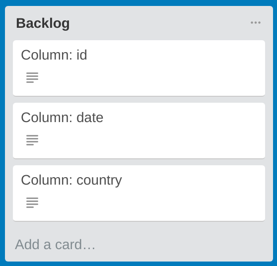

# Data Cleaning

## Test Driven Data Cleaning
### For Volunteers
Test Driven Data Cleaning is an approach that incorporates principles of Test Driven Development to achieve collaborative and reproducible data cleaning.

Basically, data cleaning scripts are divided into test scripts and cleaning scripts.

Test scripts document the expected outcomes from the data cleaning, hence we should aim to create the tests first before cleaning. Within each file you will see functions corresponding to the columns in the dataset pre-populated for you. The file names of test scripts are in the format `test_clean_<file name of dataset>`.

Cleaning scripts are where you write code to the dataset. Similar to the test scripts, within cleaning script file, you will also see functions corresponding to the columns in the dataset pre-populated for you. On execution, the cleaning script will iterate through each column row-by-row to clean the dataset. The file names of cleaning scripts are in the format `clean_<file name of dataset>`.

#### Cloning the repository
For version control, we are using Github. To clone (or get a copy of) the repository, run 
```
$ git clone <path to Github repository>
```

#### Assigning yourself a column
To track progress, we use Trello boards. There will be a dedicated Trello board for each dataset file. Within the Trello board, you will be able to see a list of backlogs, where each Trello card corresponds to the name of a column, as shown in the below image. If you open each card, you will be able to see summary statistics that can be useful for writing methods to clean the column.



To start working on, say, column 1, add yourself to the corresponding Trello card. Subsequently, proceed to create a git branch by entering the following command. Creating the git branch allows you to make changes in isolation without affecting the master code base. We recommend the branch name to be in the form of `test_clean_col_<number>`.  

```
$ git checkout -b test_clean_col_1
```

#### Testing and cleaning a column for Python users
In the `test_clean_<file name of dataset>.py` file, modify the test method as necessary. An example of the test method is shown below.

```
@pytest.mark.skip
def test_clean_col_1():
    """
    Test the cleaning for column: "date"
    """
    assert clean_sample_data.clean_col_1('NA') == 'NA'
    assert False
```

By default, the test for column 1 is skipped. To enable the test, you will have to comment or remove the line `@pytest.mark.skip` as well as the line `assert False`. Subsequently, you can proceed to define the test(s) by using the `assert` statement.

To test, run 
```
$ pytest test_clean_<file name of dataset>.py
```

You will see the test results similar to the below:  
```
============================= test session starts ==============================
platform linux -- Python 3.6.2, pytest-3.2.1, py-1.4.34, pluggy-0.4.0
rootdir: /path/to/directory, inifile:
collected 3 items                                                               

test_clean_sample_data.py s.F

=================================== FAILURES ===================================
_______________________________ test_clean_col_2 _______________________________

    def test_clean_col_2():
        """
        Test the cleaning for column: "country"
        """
>       assert clean_sample_data.clean_col_2('') == 'NA' # expects test to fail
E       AssertionError: assert 'some wrong value' == 'NA'
E         - some wrong value
E         + NA

test_clean_sample_data.py:28: AssertionError
================ 1 failed, 1 passed, 1 skipped in 0.03 seconds =================
```

In this example, you will see that there is 1 test function for each test outcome (failed, passed or skipped). You can also see a short version of the results in the line `test_clean_sample_data.py s.F` where 's' means 'skipped', '.' means 'passed', and 'F' means 'failed'. You will also see which test has failed and its actual and expected output.

Please note that you may have to install the pytest package to ensure the above command can be executed. To install pytest you can do so with one of the following commands:
```
$ pip3 install pytest # install with pip (Python 3)
$ conda install pytest # OR install with conda
```

To generate the cleaned dataset, run 
```
$ python clean_<file name of dataset>.py
```

You can find the generated file that is named `cleaned_<file name of dataset>.csv` in the designated directory.

You can download and run the completed example test and cleaning scripts in the links below.

> [test_clean_sample_data.py](https://github.com/DataKind-SG/chapter-one/blob/master/resources/examples/tddc/test_clean_sample_data.py)  
> [clean_sample_data.py](https://github.com/DataKind-SG/chapter-one/blob/master/resources/examples/tddc/clean_sample_data.py)  
> [sample_data.csv](https://github.com/DataKind-SG/chapter-one/blob/master/resources/examples/tddc/sample_data.csv)


#### Commit changes and create pull requests
Run the following command to push your changes to Github.  
```
$ git add .
$ git commit -m "<brief description of changes>"
$ git push origin test_clean_col_1
```

Subsequently, login to Github and submit a pull request for the branch that you have just changed. Reference [here](https://help.github.com/articles/creating-a-pull-request/).

### For Team Leads
#### Pre-requisites
You will need to have a Trello account. You can sign up for one at https://trello.com

You will also need to install the tddc package. To get the latest version from Github, run the following:
```
$ pip3 install git+https://github.com/DataKind-SG/test-driven-data-cleaning.git
```

Last but not least, your dataset needs to be in CSV format.

#### Creating the scaffolds and Trello board
In this walkthrough we shall use an example CSV file that can be downloaded from the link below.

> [sample_data.csv](https://github.com/DataKind-SG/chapter-one/blob/master/resources/examples/tddc/sample_data.csv)

In the same directory as the file, run:

```
$ tddc summarize sample_data.csv
```

This takes the csv data set and summarizes it, outputing to a json file in a newly created output/ directory.

If this is the first time you're running this, you should create a Trello configuration file named `.tddc_config.yml` in your user root directory with the format:

```
trello:
    api_key: <TRELL_API_KEY>
    token: <TRELLO_TOKEN>
```

You can get your Trello API key here: https://trello.com/app-key

Replace your Trello API key at the end of this URL to get your Trello token (set to expire in 1 day):

```
https://trello.com/1/authorize?expiration=1day&scope=read,write,account&response_type=token&name=Server%20Token&key=<TRELLO_API_KEY>
```

Next, you can run:

```
$ tddc build_trello sample_data.csv
```

If `.tddc_config.yml` has not yet been created, the command will fail and give you instructions on how to create a Trello configuration file in your root directory.
Once you create it, you can try to run that step again. This will create a Trello board named 'Data Cleaning board for: <file name of dataset>' under the 'Personal Boards' section. You can then optionally move the board to your team in Trello via `Show Menu > More > Settings > Change Team...`

Next, you can run:

```
$ tddc build sample_data.csv
```

This outputs a script into the output/ folder that contains method stubs and glue code to clean the data set. It also outputs stubs for tests in output/. Please refer to the previous section for volunteers to see how these test and cleaning scripts can be used.

Finally, commit the test and cleaning scripts to your team's Github repository.
