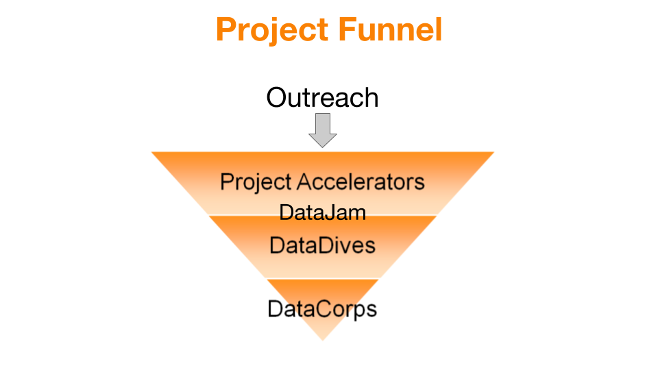

# Overview of Project Flow

We shall have an overview of the overall data project flow in this chapter. This helps to set the context and helps you relate to the recommended practices described in this book. Subsequently we shall be taking a deep dive into the specific topics.

While each of these chapters can be read independently depending on your needs, it references the project flow heavily and it helps if you read this chapter first.

## Project Funnel
In the picture below, you will see the project funnel that DataKind SG uses to assist our social sector partners

## Project Accelerators

This is the session where we bring the data science community together with our social sector partners in brainstorming sessions to take the first steps towards a successful data science project.

## DataJams

Once data has been obtained, we hold DataJam sessions that bring the data experts together with social sector partners to clean up and prepare the data prior to DataDives and/or DataCorps

## DataDive

DataDives are where the data experts and social sector partners collaborate to generate data solutions and/or products, tackling tough problems over the course of a weekend.

## DataCorps

DataCorps are specialized teams of pro bono data scientists who work on indepth, 6 to 9-month projects for social sector partners.

## DataLearn

From time-to-time, we may also conduct DataLearn sessions, where we help prepare our volunteers for DataDives through hands-on tutorials and workshops.
