# Docker Pipeline for Reproducible Research

Workshop version: 1.0.0  
Last updated: 2018-03-23  
TinyUrl Links:  

* [https://tinyurl.com/fossasia](https://tinyurl.com/fossasia)  
* [https://tinyurl.com/dockerlab](https://tinyurl.com/dockerlab)  

## Overview

Datakind Singapore has been using docker to help reproduce environments that were used during DataDive events. Apart from versioning the files/scripts that were used during analysis, we also version the environments where we ran such scripts. In this workshop, we'll walkthrough how we use docker to promote reproducibility.     

## Prerequisites

In order to follow along in this workshop, you would need to have an account in github, quay.io, and play-with-docker.

If you don't have yet, kindly create an account in the following platforms:

*  [https://github.com](https://github.com) 

*  [https://quay.io](https://quay.io) 

* [https://labs.play-with-docker.com/](https://labs.play-with-docker.com/) 

## Task 1: Setup Dockerfile

1. Before a DataDive event, we try to engage with the NGO team representatives to know what data tools the volunteers will be using during the event. Based on previous DataDive events, RStudio and Jupyter Notebooks tend to be popular among volunteers. In this workshop, we'll try to build a docker image for a python jupyter notebook. To save time, we already prepared a dockerfile and related demo materials for you. 

    Login to your github using your account.

    Then, kindly fork the following repository to your github account:

    [https://github.com/DataKind-SG/contain-yourself](https://github.com/DataKind-SG/contain-yourself)	

    Once fork is done, "contain-yourself" repo should now be reflected in your github account.

    

2. Open and examine your dockerfile:

    `https://github.com/<github_account>/contain-yourself/tree/master/workshop/demo_docker_setup/Dockerfile`

    * Replace **\<github_account\>** with your github account

    * e.g. [https://github.com/therealdatascientist/contain-yourself/tree/master/workshop/demo_docker_setup/Dockerfile](https://github.com/therealdatascientist/contain-yourself/tree/master/workshop/demo_docker_setup/Dockerfile)

    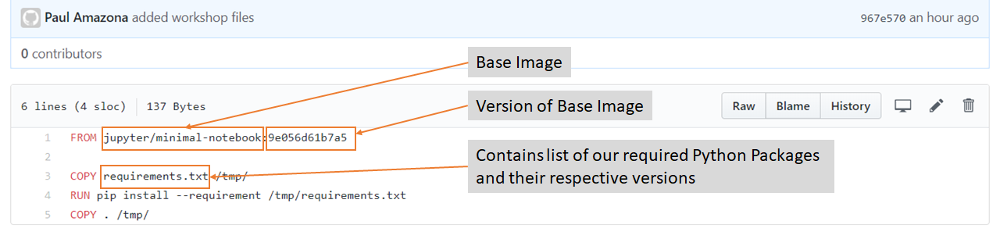

    In this dockerfile, we're using the jupyter/minimal-notebook **base image**. This contains the corresponding OS and minimal python installation to support jupyter notebook. We also reference the **version of the base image**, so that we won't be affected in case the version of the base image increments. This is so that we can still reproduce that actual base image used when the data analysis was done. 

    We also keep track of the python package versions that will later be used when building our jupyter image. You can find the list inside the requirements file:

    `https://github.com/<github_account>/contain-yourself/tree/master/workshop/demo_docker_setup/requirements.txt`

3. Now that our dockerfile is ready, we can proceed in syncing github to a continuous integration (CI) process.

## Task 2: Setup CI and Build Docker Image

1. Login to your quay.io account and go to the repository homepage: [https://quay.io/repository/](https://quay.io/repository/)

2. Create a new repository	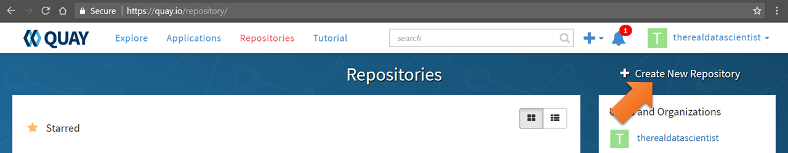 

3.  Set it up as follows:

    

4. Click "Create Public Repository"

    

5. Authorize coreos

    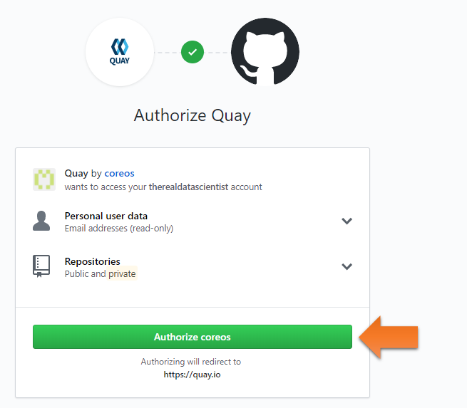

6. Select the organization under which the repository lives. In this workshop, use your github account. Then, click **continue**.

    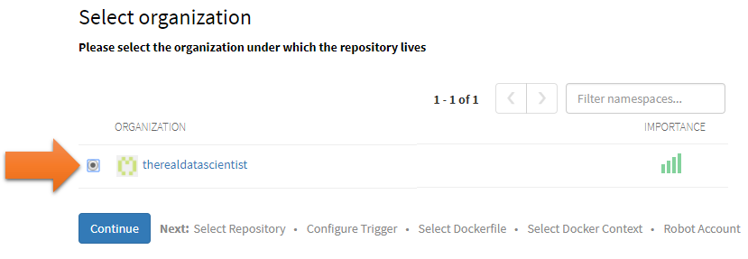

7. Select the contain-yourself repository under your github account. 

    Then, click **continue**.

    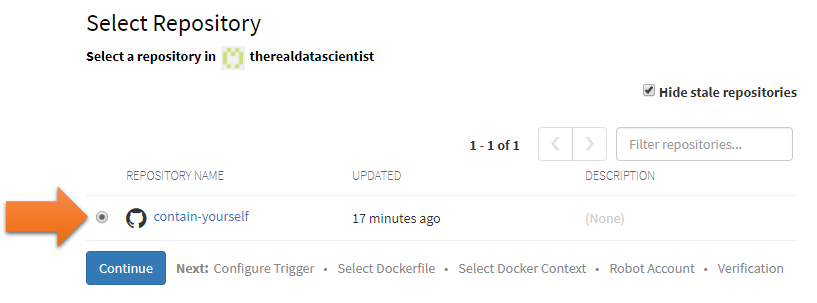

8. Configure the **trigger **so that it will only build the container image if there's a new change in the master branch. Then, click **continue**.

    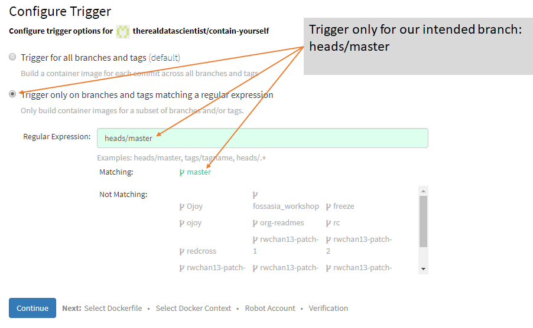

9. Select the Dockerfile under workshop: **/workshop/demo_docker_setup/Dockerfile**

    Then, click **continue**.

    

10. Select the context where our dockerfile is located: **/workshop/demo_docker_setup**

    Then, click **continue**.

    

11. There's no need for a Robot Account as we're using a public base image.

    Just click **continue**.

    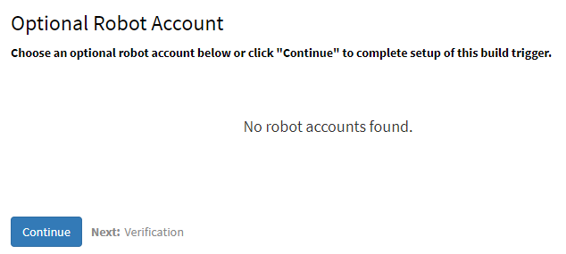

12. Whew! We're ready to go.

    Click **continue**.

    

13. Click the link to return to your repository page

    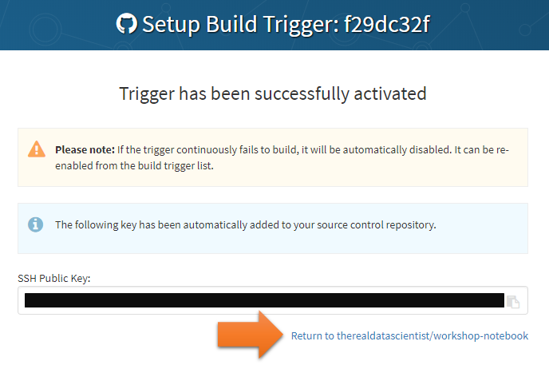

14. Initiate a new build by clicking "**Start New Build**" button

    

15. Click "**Run Trigger Now**"

    

16. Select **master** branch. Then, click "**Start Build**" button.

    

17. You should see the flashing dots indicating that the build has started.

    

18. Once the build is complete , click the **label **section .

    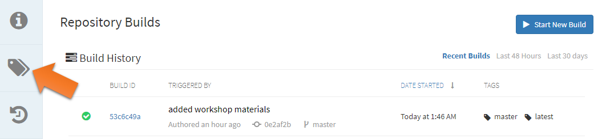

19. Click the **setting **button on the **latest **tag and click "**Add New Tag**"

    

20. Enter the version as the tag name. We use semantic versioning (https://semver.org/) MAJOR.MINOR.PATCH

    Enter **1.0.0**

    Then, click "**Create Tag**" button

    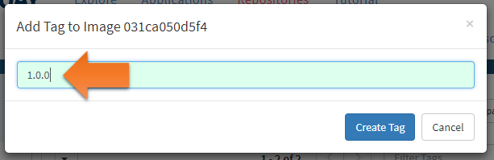

21. You should now see a new tag (version) displayed.

    This is how we version our environments to promote reproducibility later.

    

22.  Now that we have a versioned notebook image (environment),

    You can proceed in curating our volunteers' deliverables and confirm if you can reproduce their analysis.

## Task 3: Curate Deliverables

Trivia: In the previous DataDive, we have a dedicated team of deliverable curators.  
We call them our Docker Captains. They help confirm and ensure that our volunteers' analysis/outputs are reproducible. In this task, we'll put on our Docker Captain hat and curate some jupyter notebooks.

1. Docker captains usually have docker installed in their laptops during the DataDive and use that for curation. However in this workshop, we'll use play-with-docker so that you don't need to setup docker locally in your machine.

    **Login **to Play with Docker: [https://labs.play-with-docker.com/](https://labs.play-with-docker.com/) 

    

2. Click **Start**

    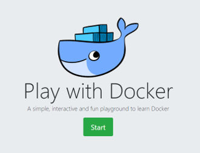

3. Click **ADD NEW INSTANCE**

    

4. In the console, git clone your **contain-yourself **github repo.

    Type the following:

    `git clone https://github.com/<your github account>/contain-yourself.git`

    Then, hit **enter**.

    

5. Type the following:

    `docker run -p 80:8888 -v /root/contain-yourself/workshop/demo_notebooks:/home/jovyan/work quay.io/<your quay.io account name>/workshop-notebook:1.0.0`

    Then, hit **enter**.

    It will start pulling the image from quay.io.

    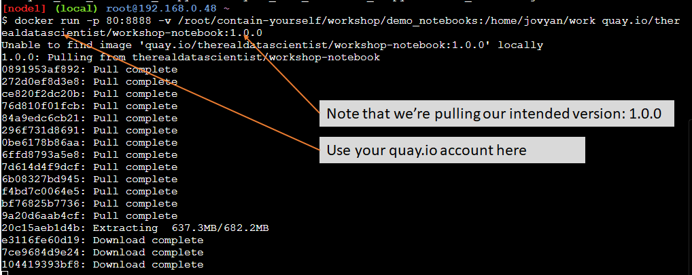

6. Once your jupyter token is ready, **click **on the port **80** link

    In the previous step, we had mapped our container's port **8888** to the host's port **80**.

    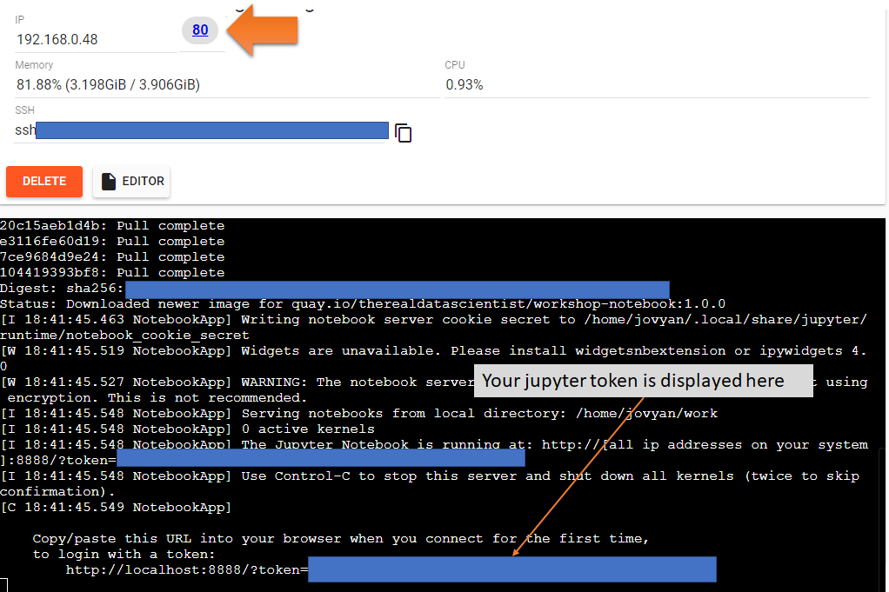

7. A new tab will open for jupyter. 

    Enter your jupyter token accordingly and click **Log in**.

    

8. You should now see 2 notebooks and 1 json data file.
    
    Click the notebook of volunteer **1**: analysis_from_volunteer_**1**.ipynb

    

9. In volunteer 1's notebook, click **Cell**.

    Then, click **Run All**.

    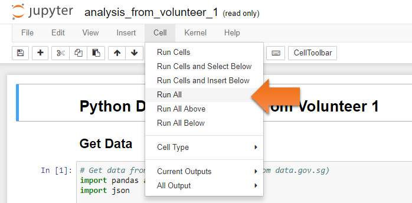

10. Scroll to the bottom of the notebook.

    You should see the following stacked bar chart generated:

    

11. Woohoo! We just successfully reproduced Volunteer 1's analysis.

    Note: Ideally, the docker captain will now proceed to add meta data on this notebook to indicate which version of the environment was used to run this successfully. However, we'll skip that in this workshop.

    **Close **the browser **tab** of volunteer 1's notebook.

    Click the notebook of volunteer **2**: analysis_from_volunteer_**2.**ipynb

    

12. In volunteer 2's notebook, click **Cell**.

    Then, click **Run All**.

    

13. In the 3rd code cell, you should see this:

    

    Oh no! We don't have bokeh in the current jupyter environment version.

    We can't reproduce Volunteer 2's analysis.

    O Captain! my Captain! Don't be downcast

    Your will is strong and the 4th task is your last

## Task 4: Resolve Environment Issue

**Note**: We're fortunate that this issue is pretty straightforward to fix.

We're just missing a package (bokeh). 

In other scenarios, docker captains face more complex issues than this (e.g. version incompatibility, missing OS binaries, etc.). It's always helpful when the author of the deliverable is still around so that such issues can be resolved quicker. 

In this workshop, we kept it simple.

1. Go back to your contain-yourself github repo and open requirements.txt:

    `https://github.com/<your github account>/contain-yourself/blob/master/workshop/demo_docker_setup/requirements.txt`

    Click **Edit**

    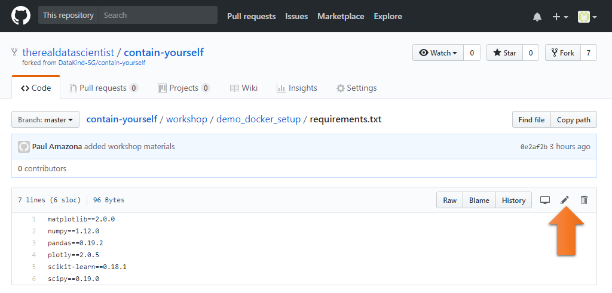

2. Write bokeh and its corresponding version (0.12.4) in the requirements.txt

    

3. Scroll down. **Add info**. Then, **commit changes**.

    

4. Go back to your build page in quay.io: 

    `https://quay.io/repository/<your quay.io account>/workshop-notebook?tab=builds`

    Notice that quay.io automatically picked up our change and started building.

    

5. Once the build is complete , click the **label **section .

    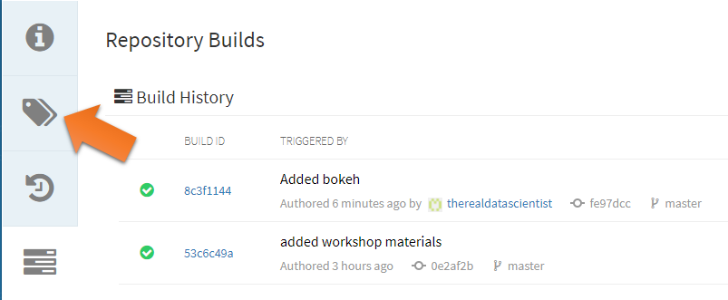

6. Click the **setting **button on the **latest **tag and click "**Add New Tag**"

    **Note**: Ensure that the latest is really the latest. Check the Last Modified stamp.

    If it's not, try refreshing the page.

    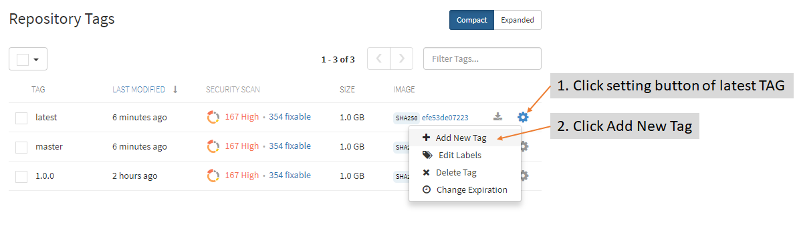

7. Enter the version as the tag name. We use semantic versioning (https://semver.org/) MAJOR.MINOR.PATCH

    Enter 1.0.**1**
    
    Then, click "**Create Tag**" button

    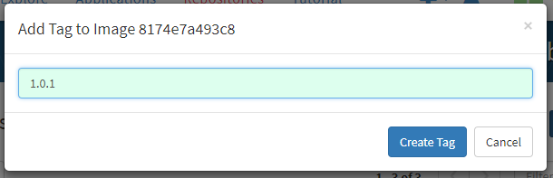

8. You should now see a new tag (version) displayed.

    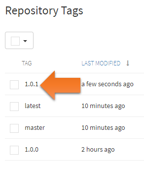

    Version 1.0.1 is the version of our jupyter image that has the bokeh package.

9. Go back to your play-with-docker console.

    If the jupyter process is still running, kill it by hitting CTRL+C.

    That should shutdown the jupyter kernels accordingly.

    

	
10. Type the following:

    `docker run -p 80:8888 -v /root/contain-yourself/workshop/demo_notebooks:/home/jovyan/work quay.io/<your quay.io account name>/workshop-notebook:1.0.1`

    Then, hit **enter**

    It will start pulling the new image (version 1.0.**1**) from quay.io.

    

11. Once your jupyter token is ready, **click **on the port **80** link

    

12. A new tab will open for jupyter. 

    Enter your jupyter token accordingly and click **Log in**.

    

13. You should now see 2 notebooks and 1 json data file.

    Let's open the notebook where we had issue previously.
    Click the notebook of volunteer **2**: analysis_from_volunteer_**2**.ipynb

14. In volunteer 2's notebook, click **Cell**.

    Then, click **Run All**.

    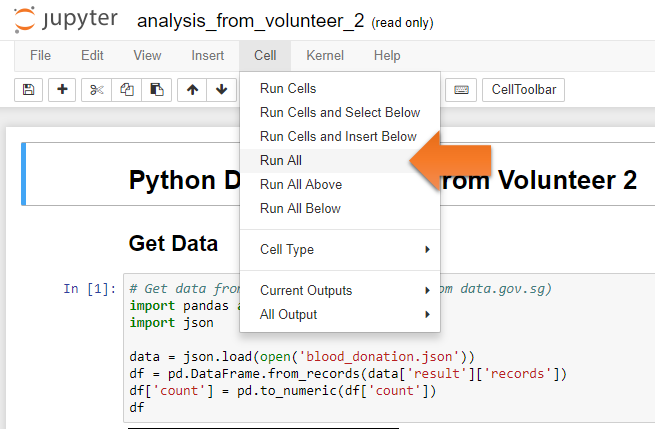

15. Scroll to the bottom of the notebook.

    You should see the following stacked bar chart generated:

    

16. Congratulations! You fixed the environment issue and you're now able to successfully reproduce Volunteer 2's analysis.

    You have the skill of a DataDive Docker Captain.

    Checkout DataKind Singapore meetup event for volunteering opportunities:

    [https://www.meetup.com/DataKind-SG/events/](https://www.meetup.com/DataKind-SG/events/) 
